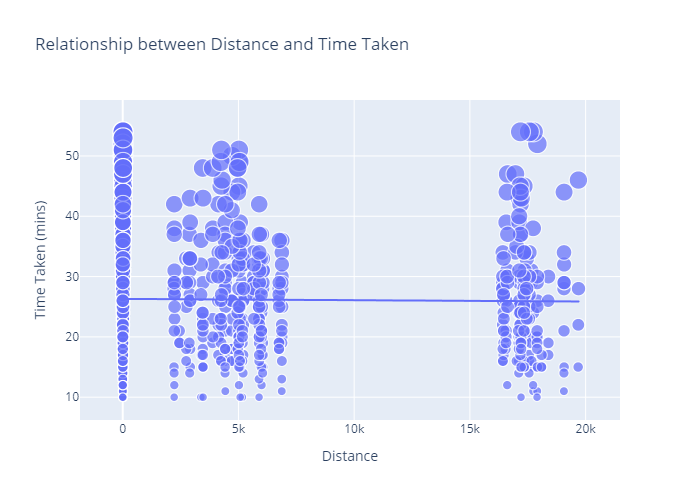
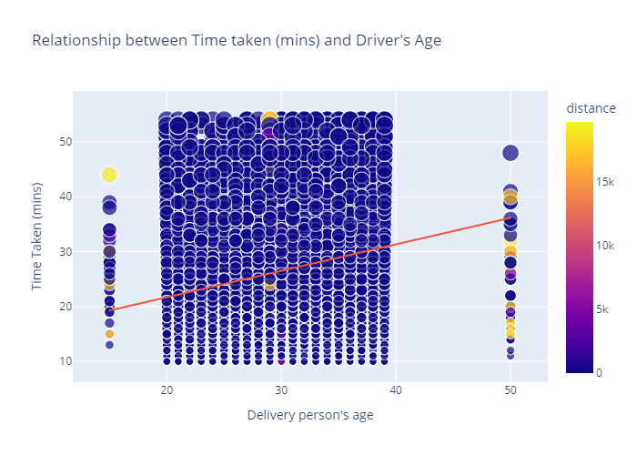
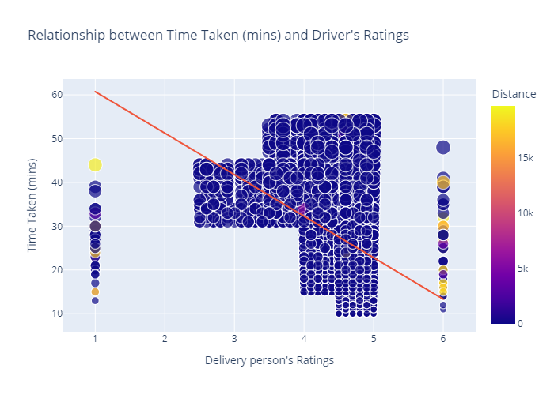
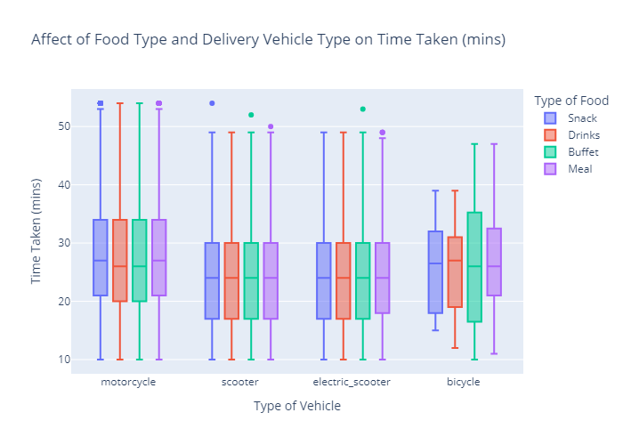
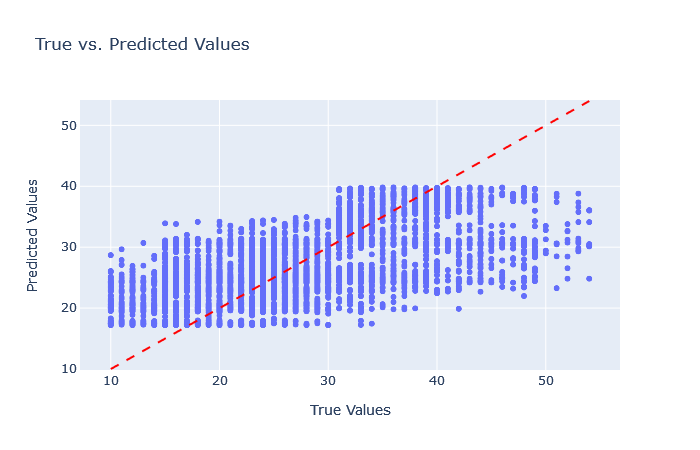

# Food Delivery Time Prediction

## Project Overview

This project aims to analyze factors affecting food delivery times and to build a predictive model using a dataset containing various attributes such as the delivery person's age, ratings, and the distance between the restaurant and delivery location. The project also visualizes the relationships between these factors and delivery time, providing insights that can help optimize delivery services. Furthermore, the model was optimized by tuning the hyperparameters.

## Dataset

The dataset includes the following features:
- `Restaurant_latitude`, `Restaurant_longitude`: The geographical coordinates of the restaurant.
- `Delivery_location_latitude`, `Delivery_location_longitude`: The geographical coordinates of the delivery location.
- `Time_taken(min)`: The time taken to deliver the food, in minutes.
- `Delivery_person_Age`: The age of the delivery person.
- `Delivery_person_Ratings`: Ratings given to the delivery person based on previous deliveries.
- `Type_of_vehicle`: The type of vehicle used for delivery (e.g., bike, car).
- `Type_of_order`: The type of food order (e.g., fast food, fine dining).

## Distance Calculation

The distance between the restaurant and the delivery location is calculated using the Haversine formula, which accounts for the curvature of the Earth and provides the shortest distance over the earth's surface. Reference for this can be found in the References section at the end.

## Exploratory Data Analysis (EDA) performed:

#### Relation between distance and time taken to deliver the food:
- To analyze the if and how the distance influences delivery time of the food by the delivery partner.

#### Relationship between the delivery time and age of the driver:
- To analyze the if and how the age of the delivery partner influences delivery time of the food by the delivery partner.

#### Relationship between delivery time and the ratings of the delivery partner:
- To analyze the if and how the ratings of the delivery partner influences delivery time of the food by the delivery partner.

#### Affect of type of food and type of vehicle used for delivery on time taken for delivery:
- To analyze the if and how the type of food ordered by the customer and the type of vehicle used by the delivery partner influences delivery time of the food by the delivery partner.

## Model Building

A Long Short-Term Memory (LSTM) model was used to predict delivery times based on the delivery person's age, ratings, and the distance to be covered.

- Model: "sequential"
- ┌──────────────────────────────┬─────────────────────────────┬─────────────────┐
- │ Layer (type)                 │ Output Shape                │         Param # │
- ├──────────────────────────────┼─────────────────────────────┼─────────────────┤
- │ lstm (LSTM)                  │ (None, 3, 128)              │          66,560 │
- ├──────────────────────────────┼─────────────────────────────┼─────────────────┤
- │ lstm_1 (LSTM)                │ (None, 64)                  │          49,408 │
- ├──────────────────────────────┼─────────────────────────────┼─────────────────┤
- │ dense (Dense)                │ (None, 25)                  │           1,625 │
- ├──────────────────────────────┼─────────────────────────────┼─────────────────┤
- │ dense_1 (Dense)              │ (None, 1)                   │              26 │
- └──────────────────────────────┴─────────────────────────────┴─────────────────┘
-  Total params: 117,619
-  Trainable params: 117,619
-  Non-trainable params: 0

Example of model working:
- Food Delivery Time Predictor
- Age of Delivery Partner: 29
- Ratings of Previous Deliveries: 2.9
- Total Distance: 6
- Predicted delivery time in minutes =  40.782604

## Hyperparameter Tuning

To improve the model's performance, hyperparameter tuning was done by tuning number of epochs, number of dense layers, number of lstm layers, and the choice of optimizer.

- Model: "sequential_1"
- ┌─────────────────────────────┬─────────────────────────────┬─────────────────┐
- │ Layer (type)                │ Output Shape                │         Param # │
- ├─────────────────────────────┼─────────────────────────────┼─────────────────┤
- │ lstm_2 (LSTM)               │ (None, 3, 224)              │          202496 │
- ├─────────────────────────────┼─────────────────────────────┼─────────────────┤
- │ lstm_3 (LSTM)               │ (None, 96)                  │          123264 │
- ├─────────────────────────────┼─────────────────────────────┼─────────────────┤
- │ dense_2 (Dense)             │ (None, 48)                  │            4656 │
- ├─────────────────────────────┼─────────────────────────────┼─────────────────┤
- │ dense_3 (Dense)             │ (None, 1)                   │              49 │
- └─────────────────────────────┴─────────────────────────────┴─────────────────┘
- Total params: 330,465
- Trainable params: 330,465
- Non-trainable params: 0

#### True values vs. Predicted values:
- Testing the model.

## Results and Insights

The model successfully learned from the training data and can predict the time it would take for a delivery based on the relevant input features after EDA. The insights that we found from this data are as follows:
- Distance vs. Time Taken: The data does not show a strong linear relationship between distance and delivery time, likely due to external factors like traffic and delivery handling times.
- Driver's Age vs. Time Taken: Younger delivery persons tend to deliver faster, with older delivery persons taking more time on average.
- Driver's Ratings vs. Time Taken: Higher-rated drivers tend to deliver faster, indicating that experience and efficiency play a significant role.
- Vehicle Type and Food Type vs. Time Taken: Electric scooters and scooters provide the most consistent delivery times, making them ideal for longer distances.

## Conclusion

This project builds on the foundational work provided in The Clever Programmer's Food Delivery Time Prediction using Python by expanding the analysis to provide deeper insights into various other aspects of the delivery time prediction.

## References:
1. [Project Reference](https://thecleverprogrammer.com/2023/01/02/food-delivery-time-prediction-using-python/)
2. [Dataset](https://statso.io/food-delivery-time-prediction-case-study/)
3. [Haversine Distance](https://en.wikipedia.org/wiki/Haversine_formula)
4. [More on Haversine Distance](https://community.esri.com/t5/coordinate-reference-systems-blog/distance-on-a-sphere-the-haversine-formula/ba-p/902128)
5. [Long short-term momory](https://en.wikipedia.org/wiki/Long_short-term_memory)
6. [Long short-term momory documentation](https://pytorch.org/docs/stable/generated/torch.nn.LSTM.html)
7. [Hyperparameter Tuning](https://www.geeksforgeeks.org/hyperparameter-tuning/#)
8. [Hyperparameter Tuning using Keras Tuner](https://keras.io/keras_tuner/)

## Citations:
KerasTuner, O'Malley, Tom and Bursztein, Elie and Long, James and Chollet, Fran\c{c}ois and Jin, Haifeng and Invernizzi, Luca and others}, 2019, https://github.com/keras-team/keras-tuner
